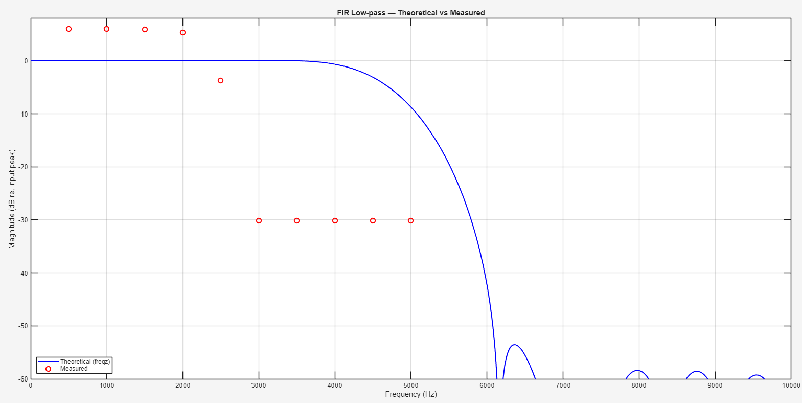
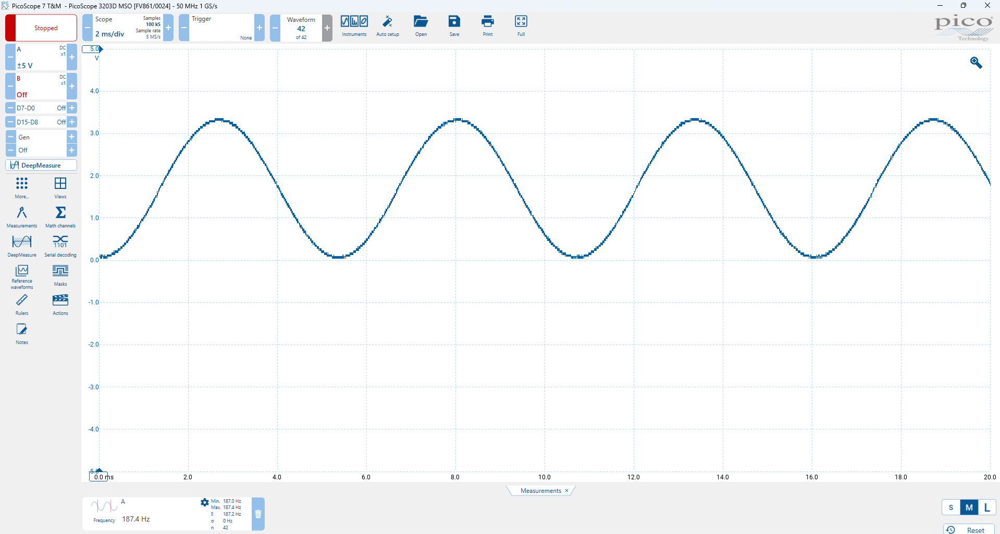

# Benchmarking STM32G4 Accelerators

This repository presents a benchmarking study of different FIR filtering implementations using the STM32G474RE microcontroller. The goal is to evaluate performance, resource usage, and efficiency of:

- **CMSIS-DSP based FIR filtering**
- **FMAC (Filter Math Accelerator) based FIR filtering**
- **DMA Synchronisation - FMAC with DMA Integration** (primary focus)

## 📌 Project Objective

To implement and benchmark real-time signal processing methods on the STM32G4 series MCU, specifically aiming to:

- Reduce CPU load and improve ISR efficiency
- Minimize latency for time-critical applications
- Enable local, low-power intelligence for edge processing

---

## ⚙️ System Overview

- A sine wave LUT is sampled and passed through a low-pass FIR filter.
- The filtered output is sent to a 12-bit DAC at **48 kHz** using a timer interrupt.
- Three implementations are compared:

### 1. CMSIS-DSP FIR Filter (Software-based)

- Uses `arm_fir_q15` from ARM’s CMSIS-DSP library
- Runs entirely on CPU
- Processes and outputs signal within the timer ISR

### 2. FMAC-based FIR Filter (Hardware Accelerator)

- Utilizes STM32G4's built-in FMAC peripheral
- Coefficients and inputs are loaded into FMAC's X1/X2 buffers
- Output read from the Y buffer

### 3. FMAC + DMA (Hardware + DMA)

- DMA moves data from LUT to FMAC WDATA register
- Timer TRGO triggers DMA transfers via DMAMUX
- Output read via interrupt when FMAC’s output buffer is full
- Minimal CPU intervention

---

## 📐 FIR Filter Design

- **Filter Type**: Low-pass FIR
- **Taps**: 21
- **Cutoff Frequency**: Normalized at 0.2
- **Coefficient Generation**: Python (`scipy.signal.firwin`)
- **Format**: Converted to Q15 for fixed-point compatibility
- Integrated into STM32CubeIDE project as `.h` and `.c` files

---

## 📊 Benchmarking Results

| Metric                  | CMSIS-DSP     | FMAC          | FMAC + DMA     |
|------------------------|---------------|---------------|----------------|
| Clock Cycles           | 1779          | 159           | 110–130        |
| Execution Time         | 10.46 µs      | 0.935 µs      | 0.64–0.76 µs   |
| RAM Usage              | 2.13%         | 2.08%         | 2.08%          |
| Flash Usage            | 3.67%         | 4.29%         | 4.14%          |
| CPU Load               | High          | Moderate      | Low            |
| Power Efficiency (est) | Lowest        | Better        | Best           |

> Note: Power estimation is relative, inferred from CPU usage (no power profiler used).

---
## 📊 Filter Results

### 1. CMSIS-DSP Q15 - 

### 2. FMAC Core - 

