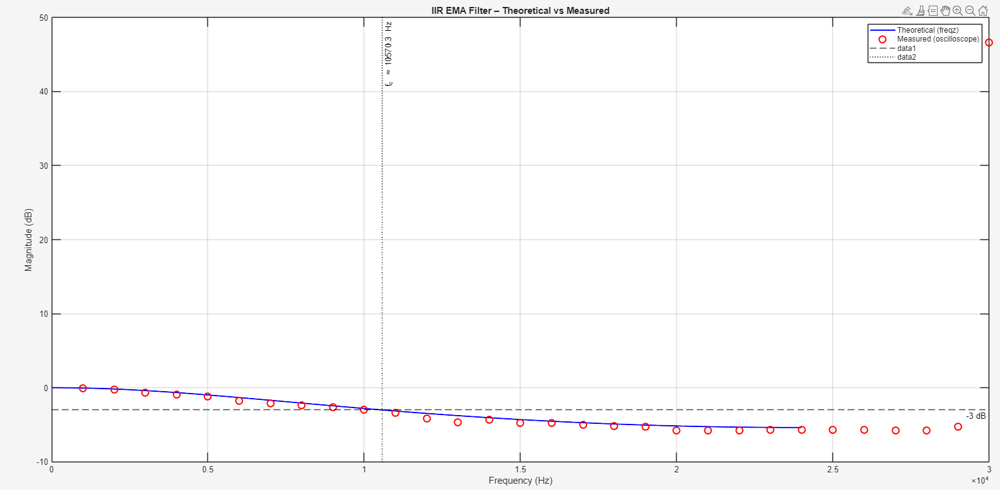
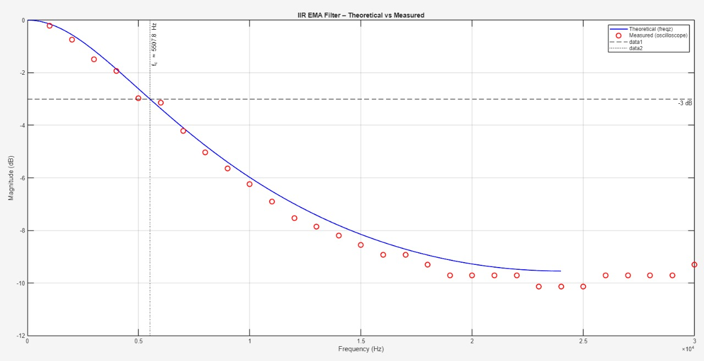
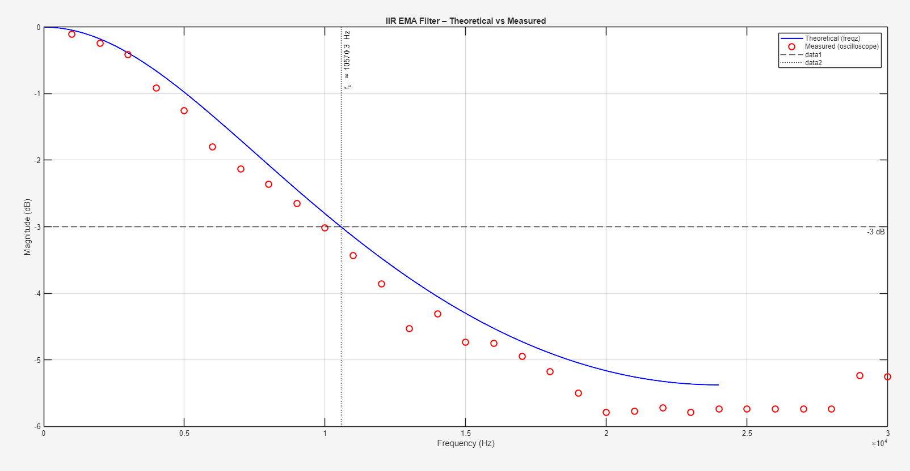
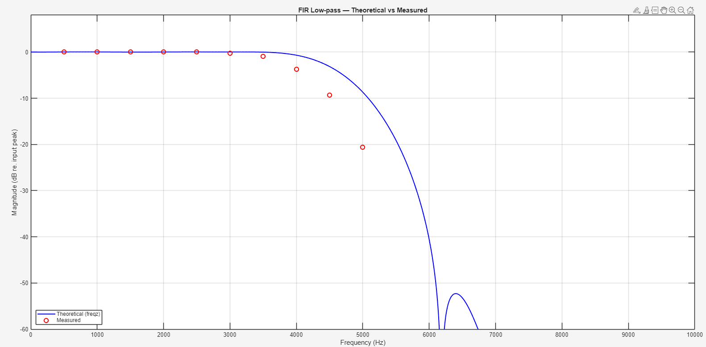

# Benchmarking STM32G4 Accelerators

This repository presents a benchmarking study of IIR and FIR filtering implementations using the STM32G474RE microcontroller. The goal is to evaluate performance, resource usage, and efficiency of:

- **CMSIS-DSP based FIR and IIR filtering**
- **FMAC (Filter Math Accelerator) based FIR and IIR filtering**

## 📌 Project Objective

To implement and benchmark real-time signal processing methods on the STM32G4 series MCU, specifically aiming to:

- Reduce CPU load and improve ISR efficiency
- Minimize latency for time-critical applications
- Enable local, low-power intelligence for edge processing

---

## ⚙️ System Overview
- TIM6(running at 48KHz) TRGO event triggers an ADC conversion
- A sine signal(900mV amplitude, 1V DC Offset) is generated through function generator of the picoscope
- The ADC HAL ConvCptCallback function gets triggered after a conversion, where the ADC samples are being read, centered, adjusted to be sent through filters(CMSIS and FMAC)
- The filtered output is then sent to 12-bit DAC
- Two implementations are compared:

### 1. CMSIS-DSP FIR Filter (Software-based)

- Uses `arm_fir_q15` from ARM’s CMSIS-DSP library
- Runs entirely on CPU
- Processes and outputs signal within the timer ISR

### 2. FMAC-based FIR Filter (Hardware Accelerator)

- Utilizes STM32G4's built-in FMAC peripheral
- Coefficients and inputs are loaded into FMAC's X1/X2 buffers
- Output read from the Y buffer

---

## 📐 FIR Filter Design

- **Filter Type**: Low-pass FIR
- **Taps**: 62
- **Cutoff Frequency**: Normalized at 0.2
- **Coefficient Generation**: used fir1 MATLAB
- **Format**: Converted to Q15 for fixed-point compatibility
- Integrated into STM32CubeIDE project as `.h` and `.c` files

- The filter coefficients were converted to Q15 format and were written to the STM32 Cube project with their absolute paths mentioned

## 📐 IIR Filter Design

- **Filter Type**: Low-pass IIR
- **alpha**: 0.5, 0.7
- **Coefficient Generation**: taps derived from alpha
- **Format**: Converted to Q15 for fixed-point compatibility
- Integrated into STM32CubeIDE project as `.h` and `.c` files

- The filter coefficients were converted to Q15 format and were written to the STM32 Cube project with their absolute paths mentioned

---

## 📊 Benchmarking Results
The below results are for IIR EMA implementation - 

| Metric                 | CMSIS-DSP     | FMAC        | 
|------------------------|---------------|---------------
| Clock Cycles           | 1779          | 159           |
| Execution Time         | 10.46 µs      | 0.935 µs      |
| RAM Usage              | 2.13%         | 2.08%         |
| Flash Usage            | 3.67%         | 4.29%         |
| CPU Load               | High          | Moderate      |
| Power Efficiency (est) | Lowest        | Better        |

> Note: Power estimation is relative, inferred from CPU usage (no power profiler used).

The below results are for FIR implementation - 

| Metric                 | CMSIS-DSP     | FMAC        | 
|------------------------|---------------|---------------
| Clock Cycles           | 2500          | 340           |
| Execution Time         | 14.7 µs       | 2 µs          |
| RAM Usage              | 2.13%         | 2.08%         |
| Flash Usage            | 3.67%         | 4.29%         |
| CPU Load               | High          | Moderate      |
| Power Efficiency (est) | Lowest        | Better        |

> Note: Power estimation is relative, inferred from CPU usage (no power profiler used).

---
## 📊 Filter Results

### 1. CMSIS-DSP Q15 - 
FIR implementation - 62 taps

IIR implementation 
1) alpha = 0.7

### 2. FMAC Core - 
IIR implementation
1) alpha = 0.5

2) alpha = 0.7

FIR implementation
1) Taps = 62

